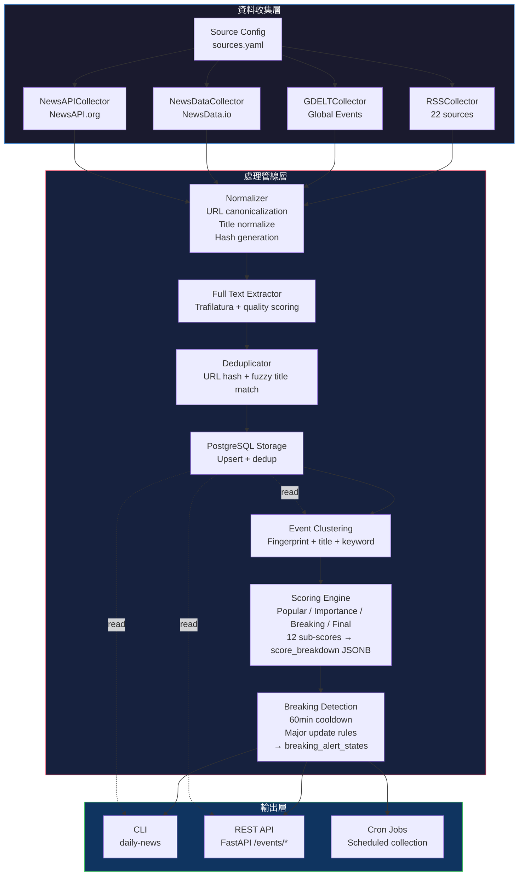

# Daily News System — 規格說明書 v1.1

> 最後更新：2026-06-03

---

## 一、系統概述

Daily News 是一個多來源新聞聚合、全文萃取、事件分群與突發事件偵測系統。支援 RSS / REST API / Sitemap 三種資料源類型，可透過 PostgreSQL 持久化儲存，並提供 CLI 與 REST API 兩種操作介面。

**技術棧：**
- Python 3.11+ / SQLAlchemy 2.0 / Alembic
- PostgreSQL 16 （支援 JSONB）
- FastAPI / Uvicorn
- Feedparser / httpx / Trafilatura
- RapidFuzz / pytest

---

## 二、系統架構



---

## 三、資料來源（30 個啟用中）

### 3.1 來源一覽

| # | 來源名稱 | type | 啟用 | 全文可萃 | 可信度 | 說明 |
|---|----------|------|:----:|:--------:|:------:|------|
| 1 | **BBC World** | RSS | ✅ | ✅ (98%) | 0.95 | UK public service broadcaster |
| 2-5 | **The Guardian** ×4 | RSS | ✅ | ✅ (100%) | 0.90 | UK progressive news outlet |
| 6-25 | **New York Times** ×20 | RSS | ✅ | ❌ (DataDome) | 0.90 | US newspaper of record |
| 26 | **GDELT World News** | gdelt | ✅ | ✅ | 0.50 | Global event database |
| 27 | **NewsAPI Top Headlines** | newsapi | ✅ | — | 0.50 | 需 API key |
| 28 | **NewsAPI Everything** | newsapi | ✅ | — | 0.50 | 需 API key |
| 29 | **NewsData.io** | newsdata | ✅ | ✅ (70%) | 0.60 | Free tier 200 req/day |

**Disabled 來源（6）：** Reuters Sitemap (0.95) · Mediastack · Currents API · Event Registry · Reuters Connect · AP API

### 3.2 Source Config YAML 結構（v1.1 新增欄位）

```yaml
sources:
  - name: BBC World
    source_type: rss
    enabled: true
    trusted: true
    priority: 10
    language: en
    category: world
    url: "https://feeds.bbci.co.uk/news/world/rss.xml"
    credibility_score: 0.95       # ← v1.1 新增
    region: "europe"              # ← v1.1 新增
    ownership_type: "public"      # ← v1.1 新增
    source_notes: "UK public service broadcaster"  # ← v1.1 新增
```

---

## 四、收集器（Collectors）

### 4.1 RSSCollector
- **輸入：** RSS/Atom feed URL
- **輸出：** list[Article]
- **限制：** 無

### 4.2 NewsAPICollector
- **輸入：** API key, endpoint, query params
- **API Key：** 環境變數 `NEWSAPI_API_KEY`
- **限制：** 免費 tier 100 req/day

### 4.3 GDELTCollector
- **輸入：** query, timespan, maxrecords, sort
- **限制：** rate limit 6s/req 內建 sleep，免費無 key

### 4.4 NewsDataCollector
- **輸入：** API key, query, country, category, language, size, page
- **API Key：** 環境變數 `NEWSDATA_API_KEY`
- **限制：** 免費 tier 200 req/day, size ≤ 10, 7-day lookback
- **分頁：** 內建 2 頁自動翻頁（nextPage token）

### 4.5 SitemapCollector
- **輸入：** XML sitemap URL
- **用途：** 站點地圖式收集（尚未啟用任何來源）

---

## 五、處理管線（Processors）

### 5.1 Normalizer
- URL 正規化（移除 utm\_ 等追蹤參數）
- SHA-256 url_hash 產生（用於 dedup）
- 標題 NFKC 正規化 + 去標點符號
- 時間統一轉 UTC

### 5.2 Full-Text 萃取（v1.1 強化）

- **工具：** Trafilatura（純文字輸出）
- **時機：** 收集後、去重前批次執行（ThreadPoolExecutor, 8 workers）
- **超時：** 20s per URL
- **User-Agent：** Chrome 131

**v1.1 新增：** 每篇文章記錄：
- `fulltext_status` — not_attempted / extracted / empty / timeout / error / paywalled
- `fulltext_quality_score` — 依內容長度分級
- `fulltext_extracted_at` — 萃取時間
- `fulltext_error_message` — 錯誤訊息（如有）

**全文品質分數計算規則：**

| 條件 | 分數 |
|------|:----:|
| empty / timeout / error / paywalled | 0.0 |
| length < 300 ch | 0.2 |
| 300 ≤ length < 500 | 0.4 |
| 500 ≤ length < 1500 | 0.6 |
| length ≥ 1500 | 0.8 |
| boilerplate noise ratio ≥ 40% | cap at 0.7 |

**各來源全文萃取實測數據：**
| 來源 | 全文率 | 平均字數 |
|------|:------:|:--------:|
| The Guardian | 100% | ~5,600 ch |
| BBC World | 98% | ~4,100 ch |
| NewsData.io 非 paywall 站 | ~70% | ~2,700 ch |
| NYT.com | ~1% | — (DataDome 403) |

### 5.3 Deduplicator
- **強去重：** URL hash 精確比對（SQL UNIQUE constraint）
- **弱去重：** 模糊標題比對（RapidFuzz，threshold ≥ 88）

### 5.4 Event Clustering（v1.1 強化）

**v1.1 新增 Fingerprint 分群規則：**
```
same category
AND same date_bucket
AND entity_overlap >= 0.5
AND keyword_overlap >= 0.4
→ same event
```

**既有分群策略（保留）：**
1. 標題相似度 ≥ 88 + 發表時間差距 ≤ 48h
2. 關鍵詞重疊 ≥ 50% + 共享實體

**Fingerprint 格式：**
```
{category}|{date_bucket}|{top_entities}|{top_keywords}
```
範例：`war_conflict|2026-06-03|us,iran|war,missile,strike`

### 5.5 Scorer（v1.1 完全重寫）

**四維分數系統（12 個子分數寫入 score_breakdown JSONB）：**

#### Popular Score
```
popular_score = 
  0.35 * article_volume_score
+ 0.30 * source_diversity_score
+ 0.20 * trusted_source_score    (credibility ≥ 0.75)
+ 0.10 * country_diversity_score
+ 0.05 * recent_velocity_score
```

#### Importance Score
```
importance_score = 
  0.35 * category_importance_score
+ 0.25 * severity_keyword_score
+ 0.20 * geopolitical_score
+ 0.10 * source_credibility_score
+ 0.10 * impact_scope_score
```

#### Breaking Score
```
breaking_score = 
  0.25 * recent_growth_score
+ 0.20 * recent_source_score
+ 0.20 * severity_keyword_score
+ 0.15 * category_importance_score
+ 0.10 * source_credibility_score
+ 0.10 * breaking_keyword_score
```

#### Final Score
```
final_score = 0.45 * popular_score + 0.55 * importance_score
```

#### Category Importance 權重表
| 類別 | 權重 |
|------|:----:|
| war_conflict | 0.95 |
| disaster | 0.90 |
| health | 0.80 |
| economy | 0.70 |
| politics | 0.65 |
| crime | 0.55 |
| technology / climate | 0.50 |
| science | 0.40 |
| sports | 0.30 |
| entertainment | 0.20 |
| 其他 | 0.30 |

### 5.6 Source Credibility（v1.1 新增）

每個來源（source）有 `credibility_score`（0.0–1.0），取代舊有的二元 `trusted`：

| 來源 | credibility_score |
|------|:----------------:|
| BBC / Reuters | 0.95 |
| Guardian / NYT | 0.90 |
| NewsData.io | 0.60 |
| NewsAPI / GDELT | 0.50 |

- `trusted_source_count` 改為計算 `credibility_score ≥ 0.75` 的來源
- `_is_trusted_source()` 優先檢查 credibility_score，無則 fallback 到 `trusted` boolean

### 5.7 Representative Article 選取（v1.1 新增）

每個事件可選出 `representative_article_id`（FK 到 articles.id）。

**排序邏輯：**
1. 排除 is_duplicate = true
2. credibility_score 高 → 優先
3. fulltext_quality_score 高 → 優先
4. published_at 較早 → 優先
5. 標題長度需在 40–140 字元間
6. 每個 source_domain 最多 1 篇
7. 最多 5 篇

### 5.8 Breaking Alert State（v1.1 新增）

**Cooldown：** 同一 event 60 分鐘內不可重複進入 alert-ready 狀態。

**重大更新（可突破 cooldown）：**
- breaking_score 比上次提升 ≥ 0.15
- trusted_source_count 比上次增加 ≥ 2
- article_count 比上次增加 ≥ 5
- category 升級為 high severity（war_conflict / disaster / economy / health / cybersecurity）

**儲存：** `breaking_alert_states` 表追蹤每次 alert 的狀態變化（first_detected_at, last_alerted_at, alert_count, max_breaking_score 等）。

---

## 六、儲存層（PostgreSQL Schema）

### 6.1 Tables

#### `articles`（v1.1 新增欄位★）
| 欄位 | 型別 | 說明 |
|------|------|------|
| id | BIGINT PK | |
| external_id | TEXT | 來源端 ID |
| source_type | VARCHAR(32) | rss / newsapi / gdelt / newsdata / sitemap |
| source_name | VARCHAR(255) | 來源名稱 |
| source_domain | VARCHAR(255) | 來源網域 |
| title | TEXT | 文章標題 |
| normalized_title | TEXT | 正規化標題 |
| description | TEXT | 摘要/描述 |
| content_snippet | TEXT | 全文內容 |
| url | TEXT | 原始 URL |
| canonical_url | TEXT | 正規化 URL |
| url_hash | VARCHAR(64) UNIQUE | SHA-256 去重 key |
| language | VARCHAR(16) | 語言代碼 |
| country | VARCHAR(16) | 國家 |
| category | VARCHAR(64) | 分類 |
| published_at | TIMESTAMPTZ | 原文發表時間 |
| collected_at | TIMESTAMPTZ | 收集時間 |
| raw_payload | JSONB | 原始 API 回傳 |
| is_duplicate | BOOLEAN | 是否重複 |
| duplicate_of_article_id | BIGINT FK | 重複指向 |
| ★ fulltext_status | VARCHAR(32) | not_attempted / extracted / empty / timeout / error / paywalled |
| ★ fulltext_quality_score | FLOAT | 全文品質分數 0.0–0.8 |
| ★ fulltext_extracted_at | TIMESTAMPTZ | 萃取時間 |
| ★ fulltext_error_message | TEXT | 錯誤訊息 |

Indexes: source_type, source_name, source_domain, published_at, collected_at, category, is_duplicate, url_hash (unique)

#### `news_sources`（v1.1 新增欄位★）
| 欄位 | 型別 | 說明 |
|------|------|------|
| id | BIGINT PK | |
| source_type | VARCHAR(32) | |
| name | VARCHAR(255) UNIQUE | |
| domain, url, country, language, category | 雜項 | |
| trusted, enabled | BOOLEAN | |
| priority | INTEGER | |
| ★ credibility_score | FLOAT | 0.0–1.0 可信度評分 |
| ★ region | VARCHAR(64) | 地區（europe / north_america / global） |
| ★ ownership_type | VARCHAR(64) | 所有權（public / private / publicly_traded / academic / commercial） |
| ★ source_notes | TEXT | 備註 |

#### `events`（v1.1 新增欄位★）
| 欄位 | 型別 | 說明 |
|------|------|------|
| id | BIGINT PK | |
| title | TEXT | 事件標題 |
| normalized_title | TEXT | 正規化標題 |
| category | VARCHAR(64) | 事件類別 |
| severity | VARCHAR(32) | 嚴重程度 |
| event_date | DATE | 事件日期 |
| first_seen_at / last_seen_at | TIMESTAMPTZ | 時間範圍 |
| article_count | INTEGER | 關聯文章數 |
| source_count / trusted_source_count | INTEGER | 來源統計 |
| country_count | INTEGER | 跨國數 |
| popular_score / importance_score / breaking_score / final_score | FLOAT | 四維分數 |
| status | VARCHAR(32) | active / archived |
| is_breaking | BOOLEAN | 是否為突發事件 |
| keywords | TEXT[] | 關鍵詞 |
| entities | JSONB | 實體 |
| ★ event_fingerprint | TEXT | `{cat}\|{date}\|{entities}\|{keywords}` |
| ★ score_breakdown | JSONB | 12 個子分數完整紀錄 |
| ★ representative_article_id | BIGINT FK | 代表文章 |
| ★ last_scored_at | TIMESTAMPTZ | 最後評分時間 |
| ★ cluster_method | VARCHAR(64) | 分群方法 |

Indexes: event_date, category, status, is_breaking, final_score, breaking_score, last_seen_at, representative_article_id

#### `event_articles`
| 欄位 | 型別 |
|------|------|
| event_id | BIGINT FK |
| article_id | BIGINT FK |
| relevance_score | FLOAT |
| is_representative | BOOLEAN |

#### `collection_runs`
| 欄位 | 型別 |
|------|------|
| id | BIGINT PK |
| source_name, source_type | VARCHAR |
| started_at / finished_at | TIMESTAMPTZ |
| status | running / success / failed |
| fetched_count / inserted_count / duplicate_count | INTEGER |
| error_message | TEXT |

#### ★ `breaking_alert_states`（v1.1 新增）
| 欄位 | 型別 | 說明 |
|------|------|------|
| id | BIGSERIAL PK | |
| event_id | BIGINT FK | 關聯事件 |
| first_detected_at | TIMESTAMPTZ | 首次偵測時間 |
| last_detected_at | TIMESTAMPTZ | 最後偵測時間 |
| last_alerted_at | TIMESTAMPTZ | 最後發送 alert 時間 |
| alert_count | INTEGER | 累計 alert 次數 |
| last_breaking_score | FLOAT | 上次 breaking score |
| max_breaking_score | FLOAT | 歷史最高 breaking score |
| last_trusted_source_count | INTEGER | 上次可信來源數 |
| last_article_count | INTEGER | 上次文章數 |
| status | VARCHAR(32) | active / inactive |
| created_at / updated_at | TIMESTAMPTZ | |

---

## 七、CLI 指令（v1.1 新增 ★）

```bash
# 安裝
pip install -e .

# ═══ 既有指令 ═══

# 收集文章（所有來源，回溯 1h）
daily-news collect
daily-news collect --source newsdata --lookback-hours 168

# 列出/驗證來源
daily-news sources list
daily-news sources validate

# 構建事件（最近 24h）
daily-news build-events --lookback-hours 24 --limit 10

# 突發事件監控（最近 60min）
daily-news watch-breaking --lookback-minutes 60 --limit 20

# 查詢
daily-news show-daily --date 2026-06-03 --limit 10
daily-news show-breaking --since-minutes 180 --limit 20

# 資料庫完整性檢查
daily-news db-smoke

# ═══ v1.1 新增指令 ═══

# 全文萃取（多種過濾模式）
daily-news extract-fulltext --lookback-hours 24 --only-missing
daily-news extract-fulltext --article-id 123
daily-news extract-fulltext --source "BBC World" --lookback-hours 72
daily-news extract-fulltext --status timeout --lookback-hours 24

# 重新評分事件
daily-news score-event --event-id 123

# 合併事件（將來源事件的文章移至目標事件）
daily-news merge-events --source-event-id 123 --target-event-id 122

# 分割事件（從事件中分出指定文章成新事件）
daily-news split-event --event-id 123 --article-ids 10,11,12
```

所有 CLI 輸出皆為 JSON 格式。

---

## 八、REST API（v1.1 強化 ★）

| 路由 | 方法 | 參數 | 說明 |
|------|------|------|------|
| `/events/daily` | GET | `date`, `limit` | 每日事件排行 + 代表文章 |
| `/events/breaking` | GET | `since_minutes`, `limit` | 突發事件 + 代表文章 |
| `/events/{id}` | GET | event_id | 事件詳情 + 完整文章列表 |

**v1.1 API 回應強化：** 每個 event 回應包含：
- `score_breakdown` — 12 個子分數 JSONB
- `representative_articles` — 代表文章列表（credibility ≥ 0.75, quality ≥ 0.4, 非重複, 每 domain 最多 1 篇, 最多 5 篇）
- `trusted_articles` — 所有符合 credibility ≥ 0.75 + quality ≥ 0.4 的文章
- `all_articles` — 所有關聯文章（含完整 metadata）

每個文章物件包含：id, title, url, source_name, source_domain, published_at, credibility_score, fulltext_quality_score, fulltext_status, language, country, category, description。

---

## 九、測試覆蓋（113 tests）

| 測試檔案 | 測試內容 |
|----------|----------|
| `test_collect_job.py` | 完整 pipeline 整合 |
| `test_sources_config.py` | sources.yaml 載入、驗證 |
| `test_data_layer_mvp.py` | DB CRUD、upsert、dedup、migration |
| `test_normalizer.py` | URL 正規化、hash、標題清洗 |
| `test_deduplicator.py` | 強/弱去重 |
| `test_newsapi_gdelt_collectors.py` | Collector 邏輯 |
| `test_postgres_integration.py` | 真實 PostgreSQL CRUD + 完整性檢查 |
| `test_step4_daily_events.py` | 每日事件建構 |
| `test_step5_breaking_events.py` | 突發事件偵測 + CLI/API 路由 |
| `test_event_clusterer.py` | 分群演算法 |
| `test_scorer.py` | 四維分數計算 |
| `test_breaking_detector.py` | Breaking 閾值 |
| ★ `test_fulltext_quality.py` | 全文品質分數（12 cases） |
| ★ `test_source_credibility.py` | 可信度載入 + scoring 整合（12 cases） |
| ★ `test_event_fingerprint.py` | Fingerprint 產生 + overlap 比對（17 cases） |
| ★ `test_breaking_alert_state.py` | Alert state cooldown + major update（12 cases，真實 PostgreSQL） |
| ★ `test_representative_articles.py` | 代表文章選取邏輯（13 cases） |

---

## 十、已知限制

| 限制 | 原因 | 現況 |
|------|------|------|
| NYT.com 全文無法萃取 | DataDome 企業級反爬蟲 | 僅有 RSS 摘要 (~160 chars) |
| NewsData.io 部分 paywall 站無全文 | 免費 tier API 回傳佔位字串 | ~70% 成功率 |
| GDELT rate limit | 單次請求需 6s sleep | 大量來源時可能超時 |
| NewsAPI.org 無全文 | 免費 tier content 截斷 | 尚未設定 API key |
| Docker 容器 DNS 部分異常 | Docker Desktop 內部 proxy | newsdata.io 已繞過 |

---

## 十一、Cron 排程建議

```yaml
# 每日收集（建議每小時一次，回溯 1h）
daily-news collect --lookback-hours 1

# 每日事件建構
daily-news build-events --lookback-hours 24 --limit 10

# 每日突發事件檢查（建議 15-30min 頻率）
daily-news watch-breaking --lookback-minutes 60 --limit 20

# 定期補全文萃取（每天一次）
daily-news extract-fulltext --lookback-hours 24 --only-missing
```

---

## 十二、擴充指南

### 加入新來源
1. 在 `sources.yaml` 新增 entry（指定 `source_type` + `credibility_score`）
2. 若已有對應 Collector → 開 `enabled: true` 即可
3. 若需新 Collector → 繼承 `BaseCollector` 實作 `fetch()`
4. 在 `config/sources.py` 的 `VALID_SOURCE_TYPES` 註冊 type
5. 在 `jobs/__init__.py` 的 `_collector_for_source` 加入路由

### 加入新 Processor
1. 建立檔案在 `processors/` 目錄
2. 在 `jobs/__init__.py` 的 `collect_job()` 中插入到合適位置
3. 撰寫對應測試

### 完整性檢查
```bash
daily-news db-smoke         # 快速檢查所有 DB table 正常運作
daily-news sources validate # 驗證 sources.yaml 格式
```